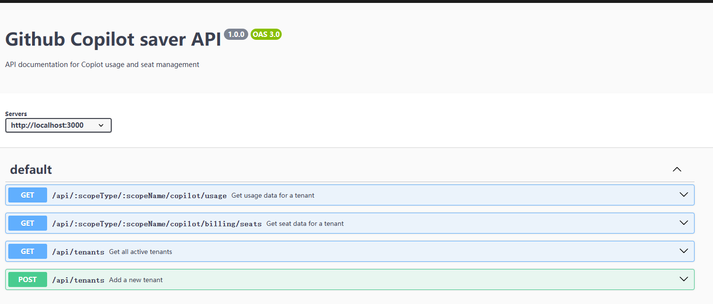

# GitHub Copilot Usage and Seat API
# My Express App

This project is designed to call the GitHub Copilot usage and seat API, save the fetched data to a file or MySQL for persistent storage, and then analyze it.

## Features

- Fetch GitHub Copilot usage and seat data.
- Save data to a file or MySQL database.
- Analyze the saved data.
- Manage tenant information with support for organizations, teams, and enterprises.
- Securely handle tenant tokens and only return active tenants.

## Installation

1. Clone the repository:
    ```sh
    git clone https://github.com/your-repo.git
    cd your-repo
    ```

2. Install dependencies:
    ```sh
    npm install
    ```

3. Configure the database and other settings in `.env`.

## Usage

### Running the Server

Start the server:
```sh
ts-node src/server.ts
```

The server will run on `http://localhost:3000`.
And for the overroll API, plese visit `http://localhost:3000/api-docs`.



### API Endpoints

#### Fetch and Save Usage Data

```http
GET /api/:scopeType/:scopeName/copilot/usage
```

**Parameters:**
- `scopeType`: The type of scope (organization, team, or enterprise).
- `scopeName`: The name of the scope.
- `token`: The authorization token (passed as a Bearer token in the Authorization header).
- `since` (optional): The start date for fetching usage data.
- `until` (optional): The end date for fetching usage data.
- `page` (optional): The page number for pagination.
- `per_page` (optional): The number of items per page for pagination.

**Example:**
```sh
curl -H "Authorization: Bearer YOUR_TOKEN" "http://localhost:3000/api/organization/example-org/copilot/usage"
```

#### Get Active Tenants

```http
GET /tenants
```

**Returns:** A list of active tenants with their `scopeType` and `scopeName`.

**Example:**
```sh
curl "http://localhost:3000/tenants"
```


## Project Structure

```
src/
├── api/
│   ├── GitHubApi.ts          # Contains functions to call GitHub APIs.
│   ├── TenantServiceFactory.ts # Factory to create tenant service instances.
│   ├── UsageServiceFactory.ts  # Factory to create usage service instances.
│   ├── MySQLTenantStorage.ts   # Implementation of tenant storage using MySQL.
│   └── FileTenantStorage.ts    # Implementation of tenant storage using the file system.
├── model/
│   ├── Tenant.ts             # Tenant model class.
│   └── Metrics.ts            # Metrics model class.
└── server.ts                 # Main server file.
```

## Tenant Model

The `Tenant` class represents a tenant and includes the following properties:

- `scopeType`: The type of scope (organization, team, or enterprise).
- `scopeName`: The name of the scope.
- `token`: The authorization token.
- `isActive`: Indicates whether the tenant is active.

The `Tenant` class also includes a method to validate the tenant using the GitHub API.

## License

This project is licensed under the MIT License. See the LICENSE file for details.